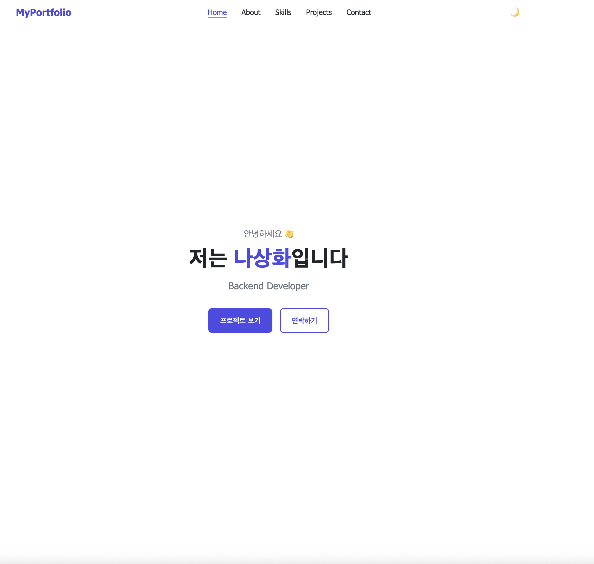
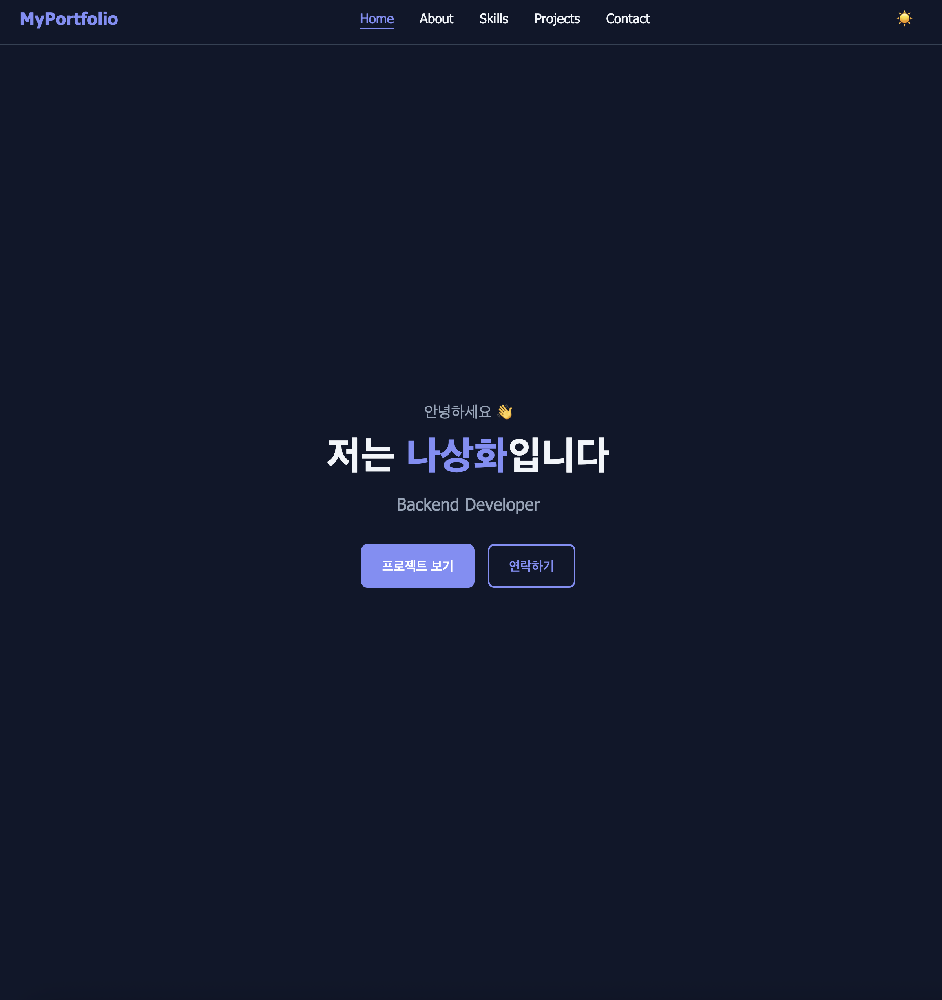
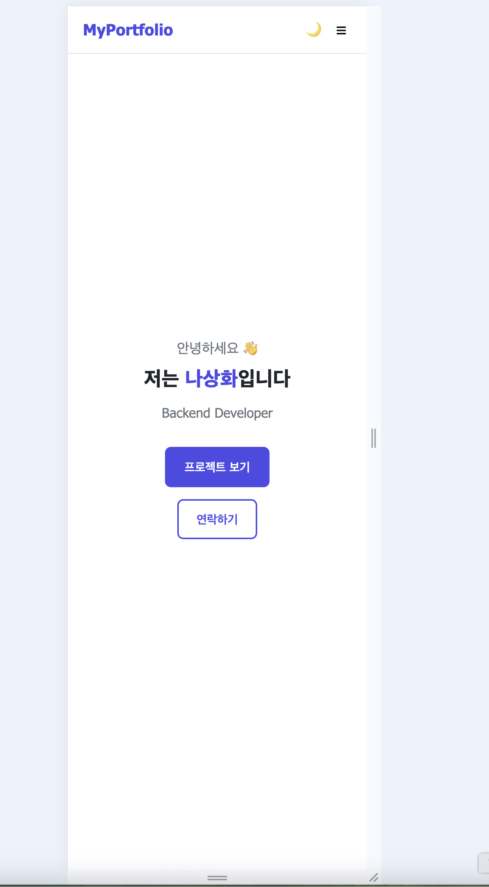

# 🌐 나상화 포트폴리오

> 순수 HTML / CSS / JavaScript로 제작한 반응형 포트폴리오 웹사이트

[](https://Sanghwa-Na.github.io/portfolio)
[](https://developer.mozilla.org/ko/docs/Web/HTML)
[](https://developer.mozilla.org/ko/docs/Web/CSS)
[](https://developer.mozilla.org/ko/docs/Web/JavaScript)

---

## 🔗 배포 주소

**[https://Sanghwa-Na.github.io/portfolio](https://Sanghwa-Na.github.io/portfolio)**

---

## 📸 미리보기

|  라이트 모드  |  다크 모드  |
|:-----------:|:---------:|
|  |  |

|  모바일 화면  |
|:-----------:|
|  |

---
 
## ✨ 주요 기능

| 기능 | 설명 |
|------|------|
| 🌙 다크/라이트 테마 | 토글 버튼으로 전환, localStorage 저장 |
| 📱 반응형 레이아웃 | 모바일(768px) / 태블릿(1024px) 대응 |
| 🍔 햄버거 메뉴 | 모바일 네비게이션 |
| 🐙 GitHub API | 최신 레포지토리 자동 불러오기 |
| 📋 폼 유효성 검사 | 실시간 검사 + 에러 메시지 |
| ✨ 스크롤 애니메이션 | Intersection Observer 기반 |
| ♿ 접근성 | prefers-reduced-motion 지원 |

---

## 🗂️ 폴더 구조

```text
portfolio/
├── index.html          # 메인 HTML
├── README.md           # 프로젝트 설명
├── css/
│   └── style.css       # 전체 스타일
├── js/
└── └── main.js         # 전체 스크립트


```

---

## 🛠️ 기술 스택

- **HTML5** - 시맨틱 마크업
- **CSS3** - Flexbox, Grid, CSS 변수, 미디어 쿼리
- **JavaScript ES6+** - fetch API, Intersection Observer, localStorage
- **GitHub API** - 레포지토리 동적 렌더링
- **GitHub Pages** - 정적 사이트 배포

---

## 📅 개발 기간

| 단계 | 내용 | 소요 시간 |
|------|------|-----------|
| 1단계 | HTML 시맨틱 마크업 | Day 1 |
| 2단계 | CSS 변수 + 테마 | Day 1 |
| 3단계 | 반응형 레이아웃 | Day 2 |
| 4단계 | JS 인터랙션 | Day 2 |
| 5단계 | GitHub API 연동 | Day 3 |
| 6단계 | 폼 유효성 검사 | Day 3 |
| 7단계 | 스크롤 애니메이션 | Day 4 |
| 8단계 | 배포 + README | Day 4 |

---

## 💡 배운 점

- CSS 변수를 활용한 테마 시스템 구현
- Intersection Observer API로 성능 최적화
- GitHub REST API 비동기 처리 및 에러 핸들링 
- 접근성(a11y)을 고려한 웹 개발

---

## 📬 Contact

- **GitHub**: [@Sanghwa-Na](https://github.com/Sanghwa-Na)
- **Email**: bdn980@gmail.com